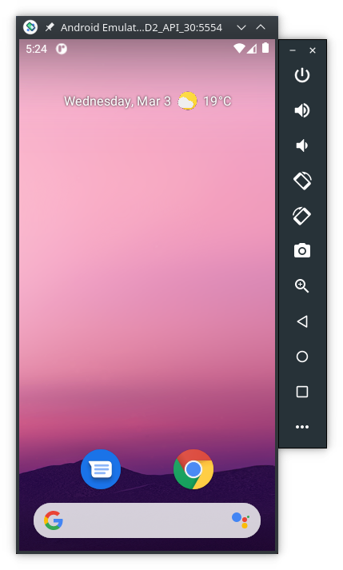
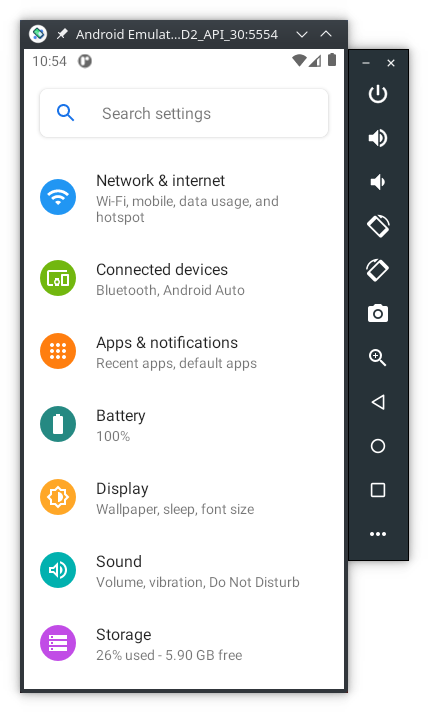
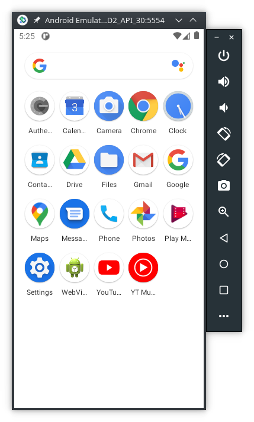

# Android4QEMU
To run Android on our PCs there are several options, being [Android Studio](https://developer.android.com/studio) one of them. However, Android Studio was created for Android developers and has a complex GUI with lots of features. Therefore, consumes lots of resources even without running the embedded emulator. To test apps and the files they generate, we don't need the Android Studio GUI.

This page explains how to set up and run the Android Studio Emulator **without** the Android Studio GUI.


# Table of Contents
- [Android4QEMU](#android4qemu)
- [Table of Contents](#table-of-contents)
  - [Credits](#credits)
  - [1. Preperation](#1-preperation)
  - [2. Linux specific set up](#2-linux-specific-set-up)
  - [3. Windows specific set up](#3-windows-specific-set-up)
  - [4. Commands to create an Android Virtual Device (AVD)](#4-commands-to-create-an-android-virtual-device-avd)
    - [4.1 Install Required Packages](#41-install-required-packages)
    - [4.2 Select the correct system-image to use](#42-select-the-correct-system-image-to-use)
    - [4.3 Download and install the selected system-image](#43-download-and-install-the-selected-system-image)
    - [4.4 Create a new AVD](#44-create-a-new-avd)
    - [4.5 Run the AVD](#45-run-the-avd)
    - [4.6 Install apps](#46-install-apps)
    - [4.7 Update emulator and SDK tools](#47-update-emulator-and-sdk-tools)
  - [5. Android apps data location](#5-android-apps-data-location)
    - [5.1 Important directories](#51-important-directories)
    - [5.2 Extract data](#52-extract-data)

## Credits 
This page is heavely based on:
- https://linuxhint.com/setup-android-emulator-without-installing-android-studio-in-linux/

Therefore, credits should go to its authors.


## 1. Preperation

1. Download the latest version of [Android Command Line Tools](https://developer.android.com/studio#downloads) for your Operating System (OS), scroll down to the command line section.
   
2. Extract the downloaded archive and make a new folder named “tools” inside “cmdline-tools” directory. Copy and paste all files from “cmdline-tools” folder to “tools” folder. Your final directory layout should look like this:

```
$ANDROID_HOME/cmdline-tools/tools 
.
├── bin
├── lib
├── NOTICE.txt
└── source.properties
```

> **_NOTE:_** `$ANDROID_HOME` is any directory here you want to install the files.
For example, on Linux `$ANDROID_HOME` can be `/opt/Android/`


## 2. Linux specific set up

Install `adb` tools:
```
sudo apt install adb
```


## 3. Windows specific set up 

1. Follow the steps listed here: https://dev.to/koscheyscrag/how-to-install-android-emulator-without-installing-android-studio-3lce until step `11.`

2. After step `11.` follow the steps from [4. Commands to create an Android Virtual Device (AVD)](#commands-to-create-an-android-virtual-device-avd)
  


## 4. Commands to create an Android Virtual Device (AVD)
These commands are the same for both Linux and Windows. However, for **Windows**
   - remove the `./` before each command
   - change the Linux `/` to the Windows `\`, except on topic [5. Forensics analysis of Android apps](#5-forensics-analysis-of-android-apps)

> **_NOTE:_** The `$` represents the command prompt and **must not be typed**

### 4.1 Install Required Packages

Go to the `$ANDROID_HOME/cmdline-tools/tools/bin` folder and run the following command to update the repository:
```
$ ./sdkmanager
```

Install packages required for the Android emulator to work:
```
$ ./sdkmanager platform-tools emulator
```

### 4.2 Select the correct system-image to use
Next we need to select a system image to load in the Android emulator. 
To get a list of latest downloadable system images (this [page](https://source.android.com/setup/start/build-numbers#platform-code-names-versions-api-levels-and-ndk-releases) has a list of all API numbers, at the time of this writting API version 30 is the latest), run the command:
```
$ ./sdkmanager --list | grep "system-images;android-30"

system-images;android-30;google_apis;x86_64 | 10      | Google APIs Intel x86 Atom_64 System Image | system-images/android-30/google_apis/x86_64/
  system-images;android-30;google_apis;x86                                                 | 9            | Google APIs Intel x86 Atom System Image                             
  system-images;android-30;google_apis;x86_64                                              | 10           | Google APIs Intel x86 Atom_64 System Image                          
  system-images;android-30;google_apis_playstore;x86                                       | 9            | Google Play Intel x86 Atom System Image                             
  system-images;android-30;google_apis_playstore;x86_64                                    | 10           | Google Play Intel x86 Atom_64 System Image
```

For the best performance choose a system-image for the `x86_64` architecture.

> **_NOTE:_** 
> We want root access to the folders inside the emulator, therefore we **cannot select** a system-image with `_playstore`


### 4.3 Download and install the selected system-image 
Download the packages using the same API level number you selected in the step above. For example:
```
$ ./sdkmanager "platforms;android-30" "system-images;android-30;google_apis;x86_64" "build-tools;30.0.3"
```

### 4.4 Create a new AVD

"Android Virtual Device" (AVD) is a set of configuration parameters that defines values for a virtual device that will emulate a real Android hardware device.

To create a new AVD, we need to use the system image we downloaded in the step above. Run the following command:
```
$ ./avdmanager create avd -n "AFD2_API_30" -k "system-images;android-30;google_apis;x86_64"
```

> **_NOTE:_** 
>  "AFD2_API_30" is the name we have chosen for our AVD


Confirm that the AVD has been successfully created using the command below:
```
$ ./avdmanager list avd
Available Android Virtual Devices:
    Name: AFD2_API_30
    Path: /home/user/.android/avd/AFD2_API_30.avd
  Target: Google APIs (Google Inc.)
          Based on: Android 11.0 (R) Tag/ABI: google_apis/x86_64
  Sdcard: 512 MB
```

Note the path of AVD in the output above. At the same path, we can find a `config.ini` file that can be used to change configuration parameters of the AVD. Edit the file `config.ini` and change the value to `yes`:

```
hw.keyboard=yes
```

> **_NOTE:_** 
> If you don't do this change, the Android buttons (home, back, and overview) won't work and you won't be able to operate the Android running in the emulator.


### 4.5 Run the AVD

To run an AVD do the following commands:
```
$ cd /$ANDROID_HOME/emulator/
$ ./emulator -avd "AFD2_API_30"
```

Below are several print screens of Android running inside the emulator:



<!--  -->

### 4.6 Install apps
A system-image without `_playstore` won't have access to the Google Play Store. So, to install apps you need to go to a website, like https://www.apkmirror.com/ and download the `APK` file of the app you want to install.

Use the `adb` commands to connect to the emulator:
```
$ adb devices
List of devices attached
emulator-5554   device
```

Then, inside the directory where you downloaded the APK file use `adb install <file>.apk`, for example:
```
$ adb install com.google.android.apps.authenticator2_5.10.apk
Success
```

### 4.7 Update emulator and SDK tools
From time to time you might need to update the installed tools. 
To update de emulator do the following commands:
```
$ cd /$ANDROID_HOME/tools/
$ ./android update sdk --no-ui
```

To update the SDK do the following commands:
```
$ cd /$ANDROID_HOME/cmdline-tools/tools/bin
$ ./sdkmanager --update
```

> **_NOTE_**
> The `android` command seems to be deprecated in favor of `sdkmanager`, however, some functionalities weren't ported yet into the new tool.

## 5. Android apps data location

The instructions below show how to acquire data from apps running inside the emulator to later perform a digital forensics analysis.

### 5.1 Important directories

**Public data** -- data that is available even on non-rooted devices:
```
$ adb shell
generic_x86_64_arm64:/ $ cd /storage/emulated/0/Android/data/<app dir>
```

However, there are 4 links that can be used as alternative paths to reach the public data dir:

```
/
├── sdcard/ → /storage/self/primary/
├── mnt/
│   ├── sdcard/ → /storage/self/primary/
│   └── user/0/primary/ → /storage/emulated/0/
└── storage/
    ├── self/primary/ → /mnt/user/0/primary/
    └── emulated/0/Android/data/
```

So, you can use also a shorter path:
```
$ adb shell
generic_x86_64_arm64:/ $ cd /sdcard/Android/data/<app dir>
```

**Private data** -- data that is only available with root (notice the change from `$` to `#` in the prompt):
```
$ adb shell
generic_x86_64_arm64:/ $ su
generic_x86_64_arm64:/ # cd /data/data/<app dir>
```

### 5.2 Extract data

1. Connect to the Android emulator and follow the steps bellow to create a `tgz` file with the contents of the private directory af an app:
```
$ adb shell
generic_x86_64_arm64:/ $ su
generic_x86_64_arm64:/ # cd /data/data/
generic_x86_64_arm64:/ # tar -cvzf /sdcard/Download/<compressed filename>.tgz <app folder>/
generic_x86_64_arm64:/ # exit
generic_x86_64_arm64:/ $ exit
```
> ***_NOTE_*** Don't copy the files directly to your computer with `adb pull` command, specially if you're using Windows, because you might loose information:
> - for example, the files `file.txt` and `File.txt` are two different files under Linux (Android uses a Linux kernel) but are the same file under Windows
> - Windows doesn't recognizes Linux's links
> - there are some characters that are allowed in Linux file names, but that aren't supported on Windows


1. Copy the `tgz` file into your computer for analysis
```
$ adb pull /sdcard/Download/<compressed filename>.tgz
/sdcard/Download/<compressed filename>.tgz: 1 file pulled. 0.1 MB/s (180 bytes in 0.010s)
```
2. If you're using Windows set up first [Windows Subsystem for Linux (WSL)](https://docs.microsoft.com/en-us/windows/wsl/install-win10), or a Linux VM, and copy the `<compressed filename>.tgz` inside the WSL/VM to avoid losing data during the decompression (see the note above)

3. Decompress the file with `7z`, or other tool that supports `.tgz` files, and start the analysis
