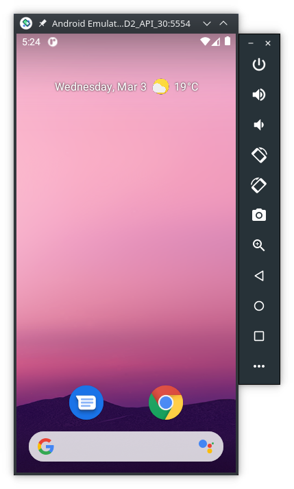
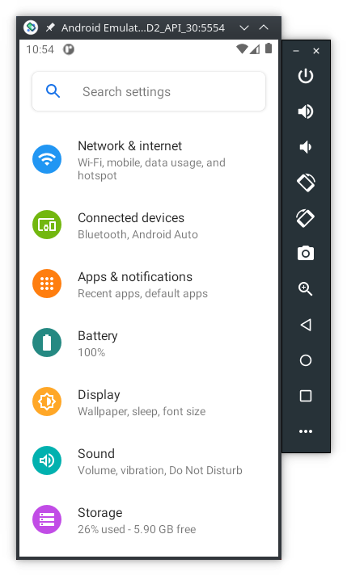

# AndroidStudioEmulator-cmdConfig <!-- omit in toc -->

To run Android on our PCs there are several options, being [Android Studio](https://developer.android.com/studio) one of them. However, Android Studio was created for Android developers and has a complex GUI with lots of features. Therefore, consumes lots of resources even without running the embedded emulator. To test apps and the files they generate, we don't need the Android Studio GUI.

This page explains how to set up and run the Android Studio Emulator **without** the Android Studio GUI using the command line tools.

|         |           |
| :-:     | :--       |
|  | This work is licensed under a [Creative Commons Attribution-NonCommercial-ShareAlike 4.0 International License](http://creativecommons.org/licenses/by-nc-sa/4.0/) |

## Table of Contents <!-- omit in toc -->

- [Credits](#credits)
- [1. Preperation](#1-preperation)
- [2. Linux specific set up](#2-linux-specific-set-up)
- [3. Windows specific set up](#3-windows-specific-set-up)
- [4. Commands to create an Android Virtual Device (AVD)](#4-commands-to-create-an-android-virtual-device-avd)
  - [4.1 Install Required Packages](#41-install-required-packages)
  - [4.2 Select the correct system-image to use](#42-select-the-correct-system-image-to-use)
  - [4.3 Download and install the selected system-image](#43-download-and-install-the-selected-system-image)
  - [4.4 Create a new AVD](#44-create-a-new-avd)
  - [4.5 Run the AVD](#45-run-the-avd)
  - [4.6 Update emulator and SDK tools](#46-update-emulator-and-sdk-tools)
- [5. Exercise](#5-exercise)

## Credits 

This page is heavely based on:

- https://linuxhint.com/setup-android-emulator-without-installing-android-studio-in-linux/

Therefore, credits should go to its author.

## 1. Preperation

1. Download the latest version of [Android Command Line Tools](https://developer.android.com/studio#downloads) for your Operating System (OS), scroll down to the command line section.

2. Extract the downloaded archive and make a new folder named “tools” inside “cmdline-tools” directory. Copy and paste all files from “cmdline-tools” folder to “tools” folder. Your final directory layout should look like this:

```console
user@linux:ANDROID_HOME$ tree -F -L 2 cmdline-tools
cmdline-tools/
└── tools/
    ├── bin/
    ├── lib/
    ├── NOTICE.txt
    └── source.properties
```

> **_NOTE:_** 
> 
> `$ANDROID_HOME` is any directory where you want to install the files and should be replaced by the actual directory where the files were installed. For example, on Linux `$ANDROID_HOME` can be `/opt/Android/`

## 2. Linux specific set up

Install `adb` tools:

```console
user@linux:ANDROID_HOME$ sudo apt install adb
```

## 3. Windows specific set up

1. Follow the steps listed here: <https://dev.to/koscheyscrag/how-to-install-android-emulator-without-installing-android-studio-3lce> until step `11.`

2. After step `11.` follow the steps from [4. Commands to create an Android Virtual Device (AVD)](#commands-to-create-an-android-virtual-device-avd)
  
## 4. Commands to create an Android Virtual Device (AVD)

These commands are the same for both Linux and Windows. However, for **Windows**

- remove the `./` before each command
- change the Linux `/` to the Windows `\`, except on topic [5. Android apps and its files](#5-android-apps-and-its-files)

> **_NOTE:_**
>
> The `$` represents the command prompt and **must not be typed**

### 4.1 Install Required Packages

Go to the `$ANDROID_HOME/cmdline-tools/tools/bin` folder and run the following command to update the repository:

```console
user@linux:ANDROID_HOME/cmdline-tools/tools/bin$ ./sdkmanager
```

Install packages required for the Android emulator to work:

```console
user@linux:ANDROID_HOME/cmdline-tools/tools/bin$ ./sdkmanager platform-tools emulator
```

### 4.2 Select the correct system-image to use

Next we need to select a system image to load in the Android emulator. 
To get a list of latest downloadable system images (this [page](https://source.android.com/setup/start/build-numbers#platform-code-names-versions-api-levels-and-ndk-releases) has a list of all API numbers, at the time of this writting API version 30 is the latest), run the command:

```console
user@linux:ANDROID_HOME/cmdline-tools/tools/bin$ ./sdkmanager --list | grep "system-images;android-30"

system-images;android-30;google_apis;x86_64              | 10   | Google APIs Intel x86 Atom_64 System Image | system-images/android-30/google_apis/x86_64/
system-images;android-30;google_apis;x86                 | 9    | Google APIs Intel x86 Atom System Image                             
system-images;android-30;google_apis;x86_64              | 10   | Google APIs Intel x86 Atom_64 System Image                          
system-images;android-30;google_apis_playstore;x86       | 9    | Google Play Intel x86 Atom System Image                             
system-images;android-30;google_apis_playstore;x86_64    | 10   | Google Play Intel x86 Atom_64 System Image
```

For the best performance choose a system-image for the `x86_64` architecture.

> **_NOTE:_**
>
> We want root access to the folders inside the emulator, therefore we **cannot select** a system-image with `_playstore`

### 4.3 Download and install the selected system-image 

Download the packages using the same API level number you selected in the step above. For example:

```console
user@linux:ANDROID_HOME/cmdline-tools/tools/bin$ ./sdkmanager "platforms;android-30" "system-images;android-30;google_apis;x86_64" "build-tools;30.0.3"
```

### 4.4 Create a new AVD

"Android Virtual Device" (AVD) is a set of configuration parameters that defines values for a virtual device that will emulate a real Android hardware device.

To create a new AVD, we need to use the system image we downloaded in the step above. Run the following command:

```console
user@linux:ANDROID_HOME/cmdline-tools/tools/bin$ ./avdmanager create avd -n "AFD2_API_30" -k "system-images;android-30;google_apis;x86_64"
```

> **_NOTE:_**
>
> "AFD2_API_30" is the name we have chosen for our AVD

Confirm that the AVD has been successfully created using the command below:

```console
user@linux:ANDROID_HOME/cmdline-tools/tools/bin$ ./avdmanager list avd
Available Android Virtual Devices:
    Name: AFD2_API_30
    Path: /home/user/.android/avd/AFD2_API_30.avd
  Target: Google APIs (Google Inc.)
          Based on: Android 11.0 (R) Tag/ABI: google_apis/x86_64
  Sdcard: 512 MB
```

Note the path of AVD in the output above. At the same path (`/home/user/.android/avd/AFD2_API_30.avd/` in this example), we can find a `config.ini` file that can be used to change configuration parameters of the AVD. Edit the file `config.ini` and change the value to `yes`:

```console
hw.keyboard=yes
```

> **_NOTE:_**
>
> If you don't do this change, the Android buttons (home, back, and overview) won't work and you won't be able to operate the Android running in the emulator.

Optionally, you can enable also the cameras by setting these values in `config.ini`:

```console
hw.camera.back = webcam0
hw.camera.front = webcam0
```

For more information about the parameters and their values read [this page](https://android.googlesource.com/platform/external/qemu/+/b5b78438ae9ff3b90aafdab0f4f25585affc22fb/android/avd/hardware-properties.ini).

### 4.5 Run the AVD

To run an AVD do the following commands:

```console
user@linux:ANDROID_HOME/cmdline-tools/tools/bin$ cd $ANDROID_HOME/emulator/
user@linux:ANDROID_HOME/emulator$ ./emulator -avd "AFD2_API_30"
```

> **_NOTE_**
>
> You might need to add your username to the `kvm` group:
> 
> ```console
> $ sudo gpasswd -a $USER kvm
> ```
>
> After this command you need to logout, and login again for the changes to take effect.

Below are several print screens of Android running inside the emulator.

|Android home screen      |  Settings screen        |
|-------------------------|-------------------------|
|  | |

### 4.6 Update emulator and SDK tools

From time to time you might need to update the installed tools. 
To update de emulator do the following commands:

```console
user@linux:ANDROID_HOME$ cd $ANDROID_HOME/tools/
user@linux:ANDROID_HOME/tools$ ./android update sdk
```

To update the SDK do the following commands:

```console
user@linux:ANDROID_HOME/tools$ cd $ANDROID_HOME/cmdline-tools/tools/bin
user@linux:ANDROID_HOME/cmdline-tools/tools/bin$ ./sdkmanager --update
```

> **_NOTE_**
>
> The `android` command seems to be deprecated in favor of `sdkmanager`, however, some functionalities weren't ported yet into the new tool.

## 5. Exercise

After setting up the Android Studio Emulator and making sure it's working, do the [exercise listed here](https://labcif.github.io/AndroidStudioEmulator-acquireAppsData/)
